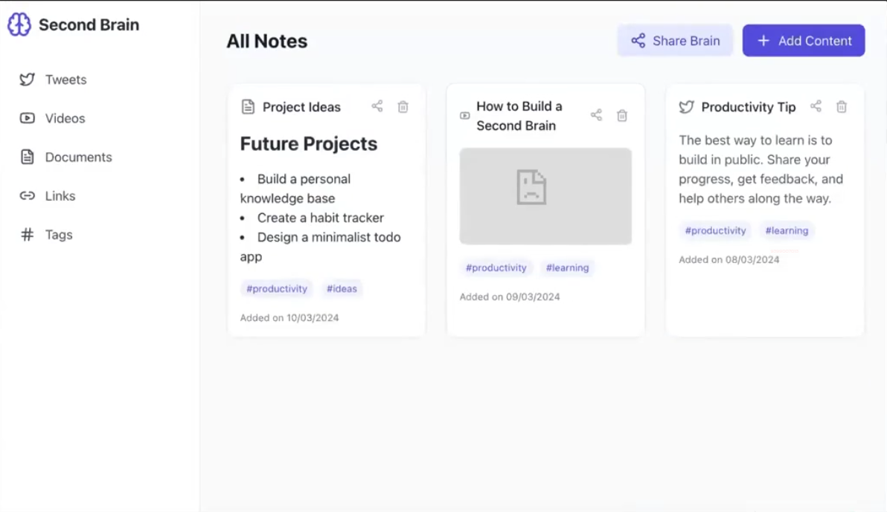

# 🧠 Second Brain

Welcome to **Second Brain** — a personal knowledge management system inspired by the idea of building a digital extension of your memory.

> ⚠️ This is a **learning project** where I’m exploring full-stack development and digital productivity tools.

## 🚀 Features

- 📒 Capture and organize notes, thoughts, and resources  
- 🔍 Search and tag system for easy retrieval  
- 🗂️ Categorize information by topic or project  
- 💡 Aims to replicate a digital "brain" for learning, reflection, and productivity

## 🛠 Tech Stack

- React / Preact (Frontend)  
- Node.js / Express (Backend)  
- MongoDB (Database)  
- Markdown support (for note formatting)

## 📚 Purpose

This project is part of my personal learning journey. I’m using it to:

- Practice full-stack development  
- Learn about personal knowledge management systems  
- Explore UX design for productivity tools

## 🏗️ Status

🛠️ **Under development** — features may change as I learn and improve the app.

## 📬 Feedback

Got suggestions or ideas? Feel free to share them! I'm always looking to grow and improve.

---

Made with 💻 and ☕ by kajal jotwani
